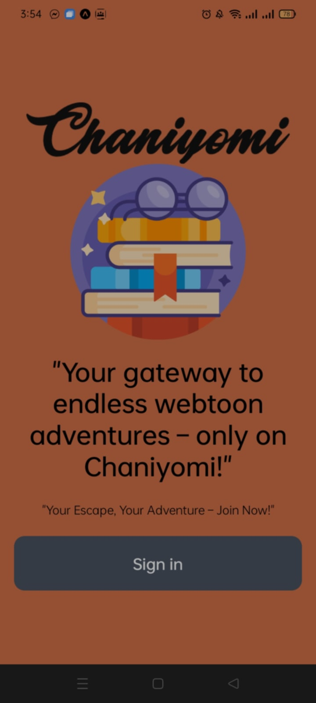
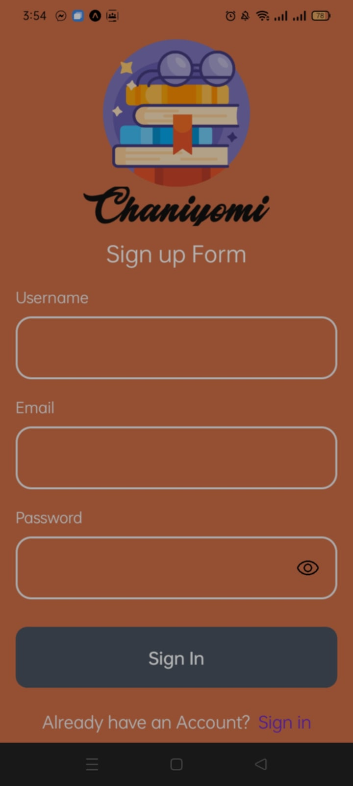
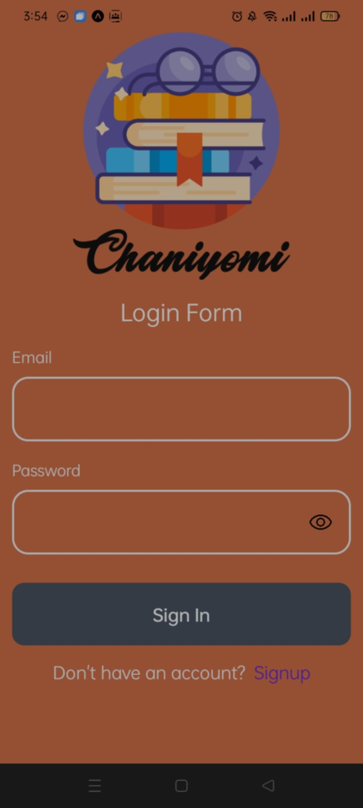
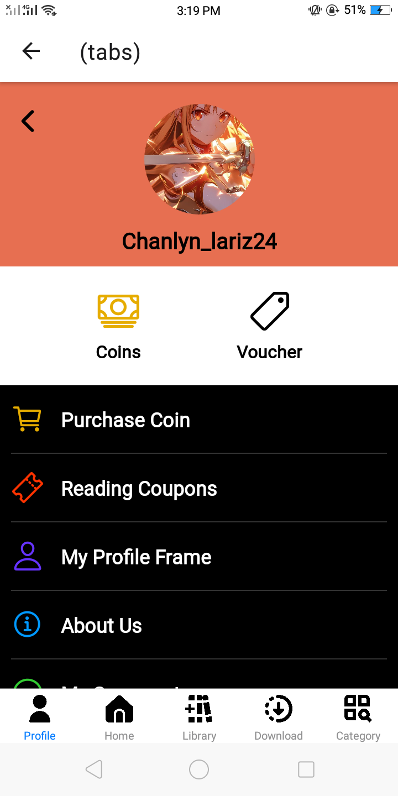
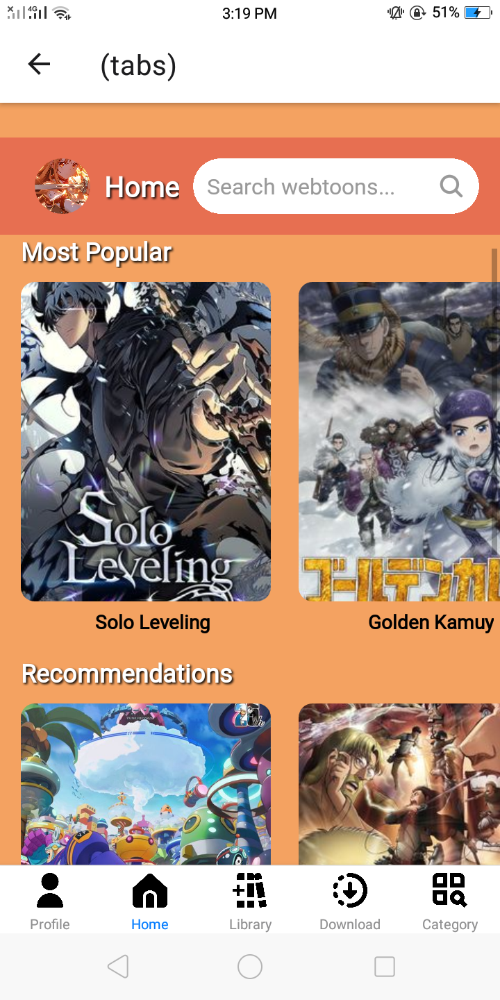
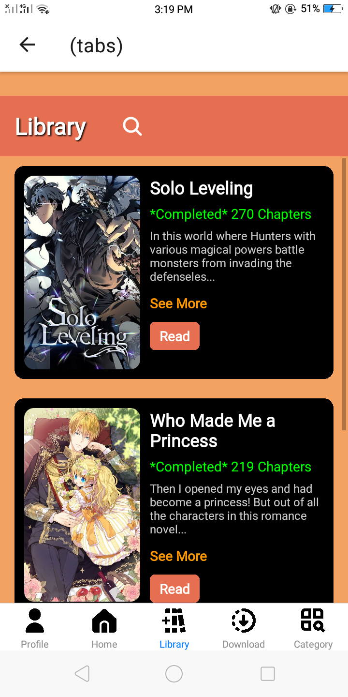
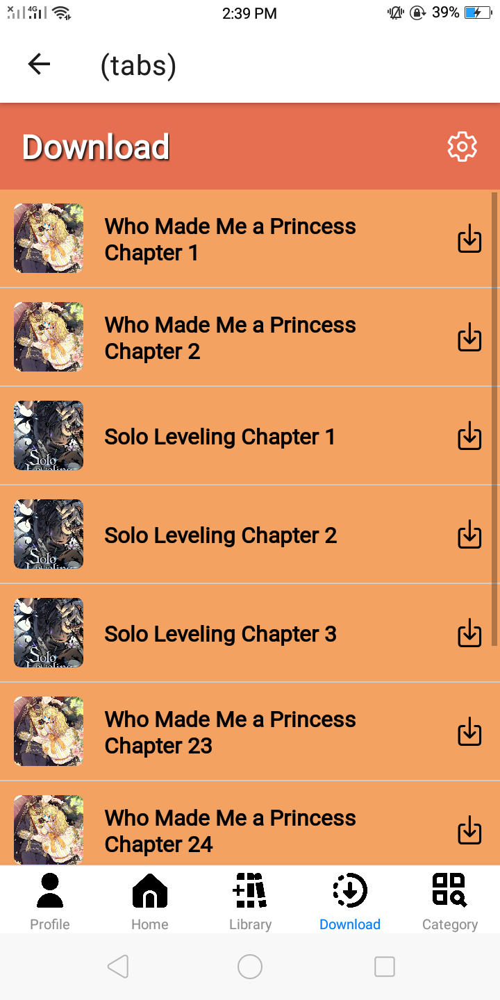
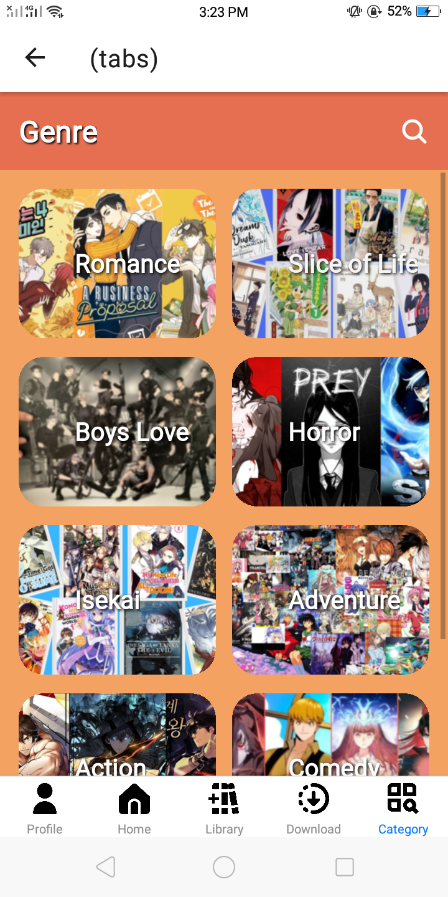

# Chaniyomi
Chaniyomi Webtoon App.

# Features
* Share Projects
* Message other developers
* Rate others work
* Search other developers

# Course Overview
* Basic React Native Components
* Database Design using Appwrite
* User Registration & Authenticaiton
* Deployment

# Tech Stack
* React Native
* AppWrite
* HTML, CSS and JS

# Home Screen
  

# Sign Up Screen
  

# Sign In Screen
  

# Tabs Screen
   # Profile
    

   # Home
     

   # Library
     
   
   # Download
   

   # Category
   

   # Screen Demo
   < a href="https://youtu.be/uknbDvIi1w0?si=Jo8XPrzosi0q0_l5">
   
